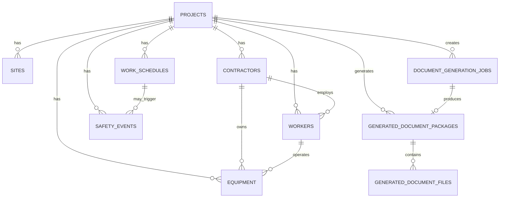

# V1.1 신축공사 데이터 모델 설계

**작성일**: 2026-04-29  
**기준**: new_construction_web_generation_flow.md + Stage 0 현황 보고서  
**범위**: V1.1 MVP 최소 데이터 모델  
**상태**: DESIGN ONLY (코드/migration 생성 금지)

---

## 목차

1. [설계 개요](#1-설계-개요)
2. [전체 ERD](#2-전체-erd)
3. [테이블 설계](#3-테이블-설계)
4. [Project 확장 비교](#4-project-확장-비교)
5. [자동생성 Rule과 데이터 연결](#5-자동생성-rule과-데이터-연결)
6. [개인정보/보안 기준](#6-개인정보보안-기준)
7. [Migration 전략](#7-migration-전략)
8. [Stage 2 구현 우선순위](#8-stage-2-구현-우선순위)

---

## 1. 설계 개요

### 1-1. 설계 범위

**포함 (10개 테이블)**:
1. projects (확장)
2. sites (신규)
3. contractors (신규)
4. workers (신규)
5. equipment (신규)
6. work_schedules (신규)
7. safety_events (신규)
8. document_generation_jobs (신규)
9. generated_document_packages (신규)
10. generated_document_files (신규)

**제외**:
- 리모델링/개보수 전용 모델
- 외국인 다국어 모델
- 소방감리 전용 모델
- PDF/HWP 변환 테이블
- 결재 워크플로우
- 회계/정산

### 1-2. 설계 원칙

1. 기존 project 테이블 존중 (CRUD API 충돌 방지)
2. 신축공사(new_construction) 중심 설계
3. project_id 기준 데이터 연결
4. 파일은 DB 저장 금지 (file_path/storage_key 관리)
5. 주민등록번호/민감정보 저장 금지
6. Soft delete 원칙 검토
7. psycopg2 직접 SQL 구조 우선 유지

### 1-3. 타입 설정 기준

현재 backend/db.py는 psycopq2 직접 SQL을 사용하므로:

```python
# Python → PostgreSQL 타입 매핑
str         → VARCHAR, TEXT
int         → INTEGER, BIGINT
bool        → BOOLEAN
date        → DATE
datetime    → TIMESTAMP WITH TIME ZONE
decimal     → DECIMAL, NUMERIC
UUID        → UUID 또는 TEXT (16진수 32자)
list/dict   → JSON, JSONB
enum        → VARCHAR (제약 조건) 또는 ENUM 타입
```

---

## 2. 전체 ERD

### 2-1. 텍스트 ERD

```
┌─────────────┐
│  projects   │ (기존, 확장)
├─────────────┤
│ id (PK)     │◄──┐
│ title       │   │
│ project_type│ (확장 필드)
│ ...         │
└─────────────┘   │
     ▲            │ 1:M
     │            │
     ├────────────┤
     │            │
     │   ┌─────────────┐
     │   │   sites     │
     │   ├─────────────┤
     │   │ site_id(PK) │
     │   │ project_id  │
     │   └─────────────┘
     │
     │   ┌──────────────┐
     │   │ contractors  │
     │   ├──────────────┤
     │   │ contractor_id│
     │   │ project_id   │
     │   └──────────────┘
     │
     │   ┌──────────────┐
     │   │  workers     │
     │   ├──────────────┤
     │   │ worker_id    │
     │   │ project_id   │
     │   │ contractor_id│ (nullable)
     │   └──────────────┘
     │
     │   ┌──────────────┐
     │   │  equipment   │
     │   ├──────────────┤
     │   │ equipment_id │
     │   │ project_id   │
     │   │ operator_id  │(FK→workers)
     │   └──────────────┘
     │
     │   ┌─────────────────┐
     │   │ work_schedules  │
     │   ├─────────────────┤
     │   │ schedule_id     │
     │   │ project_id      │
     │   │ contractor_id   │(nullable)
     │   └─────────────────┘
     │
     │   ┌─────────────────┐
     │   │ safety_events   │
     │   ├─────────────────┤
     │   │ event_id        │
     │   │ project_id      │
     │   │ worker_id       │(nullable)
     │   │ equipment_id    │(nullable)
     │   │ schedule_id     │(nullable)
     │   └─────────────────┘
     │
     │   ┌──────────────────────────┐
     │   │document_generation_jobs  │
     │   ├──────────────────────────┤
     │   │ job_id                   │
     │   │ project_id               │
     │   │ trigger_type             │
     │   │ status                   │
     │   └──────────────────────────┘
     │
     └───►┌─────────────────────────────┐
         │generated_document_packages  │
         ├─────────────────────────────┤
         │ package_id (PK)             │
         │ project_id (FK)             │
         │ job_id (FK, nullable)       │
         │ package_type                │
         │ status                      │
         └─────────────────────────────┘
              │ 1:M
              │
              └───►┌──────────────────────────┐
                  │generated_document_files  │
                  ├──────────────────────────┤
                  │ file_id (PK)             │
                  │ package_id (FK)          │
                  │ form_type                │
                  │ supplemental_type        │
                  │ file_path/storage_key    │
                  └──────────────────────────┘
```

### 2-2. Mermaid ERD



---

## 3. 테이블 설계

### 3-1. projects (기존 테이블, 확장 필요)

**목적**: 신축공사 프로젝트 기본 정보 저장

**현재 필드** (기존):
```sql
CREATE TABLE projects (
  id INTEGER PRIMARY KEY,
  title VARCHAR,
  status VARCHAR,
  created_at TIMESTAMP,
  updated_at TIMESTAMP
);
```

**확장 필드** (V1.1):
```sql
ALTER TABLE projects ADD COLUMN (
  project_name VARCHAR(255) NOT NULL,           -- 공사명
  project_type VARCHAR(50),                     -- ENUM: 신축건축, 신축토목, 신축기타
  
  -- 발주/시공사
  client_name VARCHAR(255),                     -- 발주자명
  contractor_name VARCHAR(255),                 -- 시공사명
  
  -- 위치
  location VARCHAR(500),                        -- 공사 위치 (주소)
  site_address VARCHAR(500),                    -- 상세 주소
  
  -- 금액
  contract_amount DECIMAL(20, 2),               -- 공사 금액
  
  -- 일정
  planned_start_date DATE,                      -- 예정 착공일
  planned_end_date DATE,                        -- 예정 준공일
  actual_start_date DATE,                       -- 실제 착공일
  actual_end_date DATE,                         -- 실제 준공일
  
  -- 진행 상태
  phase VARCHAR(50) DEFAULT '등록',             -- ENUM: 등록, 착공전준비, 착공, 진행중, 준공
  phase_updated_at TIMESTAMP,                   -- phase 변경일시
  
  -- 안전 담당자
  safety_manager_id VARCHAR(50),                -- FK to users (nullable)
  
  -- 메타
  created_by VARCHAR(50),                       -- 생성자 ID
  updated_by VARCHAR(50)                        -- 수정자 ID
);
```

**필드별 상세**:

| 필드 | 타입 | 필수 | 인덱스 | 비고 |
|------|------|------|--------|------|
| project_name | VARCHAR(255) | Y | Y | 공사명 |
| project_type | VARCHAR(50) | N | — | ENUM: 신축건축/토목/기타 |
| client_name | VARCHAR(255) | N | — | 발주자 |
| contractor_name | VARCHAR(255) | N | — | 시공사 (원청) |
| location | VARCHAR(500) | Y | — | 공사 위치 (주소) |
| planned_start_date | DATE | Y | — | 예정 착공 |
| planned_end_date | DATE | Y | — | 예정 준공 |
| phase | VARCHAR(50) | Y | Y | Phase 상태 |
| safety_manager_id | VARCHAR(50) | N | — | FK to users |

**상태값 (enum)**:
```
project_type: 신축건축, 신축토목, 신축기타
phase: 등록, 착공전준비, 착공, 진행중, 준공
```

**외래키**:
- safety_manager_id → users.id (nullable)

**생성/수정/삭제 정책**:
- Soft delete 미적용 (공사는 삭제 없음)
- updated_at 자동 갱신

**V1.1 포함**: ✓ 모두 포함

**V2.0 후보**:
- floor_count (지상층수)
- basement_floor_count (지하층수)
- excavation_depth_m (굴착 깊이)
- has_tower_crane (타워크레인 여부)
- safety_plan_required (안전계획 필수 여부)

---

### 3-2. sites (신규 테이블)

**목적**: 신축공사 현장 정보

**필드**:
```sql
CREATE TABLE sites (
  site_id UUID PRIMARY KEY DEFAULT gen_random_uuid(),
  project_id INTEGER NOT NULL,               -- FK to projects
  
  site_name VARCHAR(255),                    -- 현장명 (보통 공사명과 동일)
  site_address VARCHAR(500),                 -- 현장 주소 (상세)
  
  -- 담당자
  site_manager_id VARCHAR(50),               -- FK to users (현장소장)
  site_manager_name VARCHAR(255),            -- 현장소장명
  
  safety_manager_id VARCHAR(50),             -- FK to users (현장 안전관리자)
  safety_manager_name VARCHAR(255),          -- 안전관리자명
  
  -- 연락처
  phone_number VARCHAR(20),                  -- 현장 연락처
  emergency_contact VARCHAR(20),             -- 긴급 연락처
  
  -- 현장 상태
  status VARCHAR(50) DEFAULT '준비중',       -- ENUM: 준비중, 개설, 운영중, 준공
  total_workers INTEGER DEFAULT 0,           -- 근로자 총수
  total_subcontractors INTEGER DEFAULT 0,    -- 협력업체 수
  
  -- 메타
  created_at TIMESTAMP DEFAULT CURRENT_TIMESTAMP,
  updated_at TIMESTAMP DEFAULT CURRENT_TIMESTAMP
  
  FOREIGN KEY (project_id) REFERENCES projects(id)
);

CREATE INDEX idx_sites_project_id ON sites(project_id);
```

**필드별 상세**:

| 필드 | 타입 | 필수 | 인덱스 | 비고 |
|------|------|------|--------|------|
| site_id | UUID | Y (PK) | Y | 현장 ID |
| project_id | INTEGER | Y | Y | FK to projects |
| site_name | VARCHAR(255) | Y | — | 현장명 |
| site_address | VARCHAR(500) | Y | — | 주소 |
| site_manager_id | VARCHAR(50) | N | — | FK to users |
| phone_number | VARCHAR(20) | N | — | 현장 연락처 |
| status | VARCHAR(50) | Y | — | 상태 |

**상태값**:
```
status: 준비중, 개설, 운영중, 준공
```

**외래키**:
- project_id → projects.id
- site_manager_id → users.id (nullable)
- safety_manager_id → users.id (nullable)

**V1.1 포함**: ✓

**V2.0 후보**:
- latitude, longitude (GPS 좌표)
- site_image_url (현장 사진)
- site_map_url (현장 도면)

---

### 3-3. contractors (신규 테이블)

**목적**: 협력업체 정보 (도급인/수급인)

**필드**:
```sql
CREATE TABLE contractors (
  contractor_id UUID PRIMARY KEY DEFAULT gen_random_uuid(),
  project_id INTEGER NOT NULL,               -- FK to projects
  
  -- 기본정보
  company_name VARCHAR(255) NOT NULL,        -- 협력업체명
  company_registration_no VARCHAR(20),       -- 사업자등록번호
  representative_name VARCHAR(255),          -- 대표자명
  contractor_type VARCHAR(50),               -- ENUM: 원청, 협력, 일용
  
  -- 담당자
  supervisor_id VARCHAR(50),                 -- FK to users (관리감독자)
  supervisor_name VARCHAR(255),
  
  safety_contact_id VARCHAR(50),             -- FK to users (안전담당자)
  safety_contact_name VARCHAR(255),
  
  contact_phone VARCHAR(20),                 -- 협력업체 연락처
  contact_email VARCHAR(100),                -- 협력업체 이메일
  
  -- 안전 정보
  safety_level VARCHAR(50),                  -- ENUM: 높음, 중간, 낮음
  has_safety_manager BOOLEAN DEFAULT FALSE,  -- 안전관리자 배치 여부
  
  -- 계약 정보
  contract_date DATE,                        -- 계약일
  contract_amount DECIMAL(20, 2),            -- 계약금액
  primary_work_type VARCHAR(255),            -- 주 공종
  
  -- 상태
  status VARCHAR(50) DEFAULT '신청',         -- ENUM: 신청, 승인, 진행, 완료
  
  -- 메타
  created_at TIMESTAMP DEFAULT CURRENT_TIMESTAMP,
  updated_at TIMESTAMP DEFAULT CURRENT_TIMESTAMP
  
  FOREIGN KEY (project_id) REFERENCES projects(id)
);

CREATE INDEX idx_contractors_project_id ON contractors(project_id);
```

**필드별 상세**:

| 필드 | 타입 | 필수 | 인덱스 | 비고 |
|------|------|------|--------|------|
| contractor_id | UUID | Y (PK) | Y | 협력업체 ID |
| project_id | INTEGER | Y | Y | FK to projects |
| company_name | VARCHAR(255) | Y | — | 협력업체명 |
| company_registration_no | VARCHAR(20) | N | — | 사업자등록번호 |
| safety_level | VARCHAR(50) | N | — | 안전 수준 |
| contract_amount | DECIMAL(20, 2) | N | — | 계약금액 |
| status | VARCHAR(50) | Y | — | 상태 |

**상태값**:
```
contractor_type: 원청, 협력, 일용
safety_level: 높음, 중간, 낮음
status: 신청, 승인, 진행, 완료
```

**외래키**:
- project_id → projects.id
- supervisor_id → users.id (nullable)
- safety_contact_id → users.id (nullable)

**V1.1 포함**: ✓

---

### 3-4. workers (신규 테이블)

**목적**: 근로자 정보

**필드**:
```sql
CREATE TABLE workers (
  worker_id UUID PRIMARY KEY DEFAULT gen_random_uuid(),
  project_id INTEGER NOT NULL,               -- FK to projects
  contractor_id UUID,                        -- FK to contractors (nullable, 정규근로자는 null)
  
  -- 기본정보
  worker_name VARCHAR(255) NOT NULL,         -- 근로자명
  employee_id VARCHAR(50),                   -- 사원번호
  worker_type VARCHAR(50) DEFAULT '협력',    -- ENUM: 정규, 협력, 외국인
  role VARCHAR(50),                          -- ENUM: 관리감독자, 작업원, 운전원, 안전담당, 기타
  
  -- 자격정보
  certifications TEXT,                       -- JSON: [{cert_type, cert_no, expiry_date}, ...]
  
  -- 근무정보
  entry_date DATE NOT NULL,                  -- 투입예정일
  actual_entry_date DATE,                    -- 실제 투입일
  exit_date DATE,                            -- 퇴장예정일
  actual_exit_date DATE,                     -- 실제 퇴장일
  status VARCHAR(50) DEFAULT '예정',         -- ENUM: 예정, 투입, 휴직, 종료
  
  -- 교육 추적
  initial_training_completed BOOLEAN DEFAULT FALSE,  -- 채용 시 기초교육 완료
  initial_training_date DATE,                        -- 채용 시 교육일
  
  -- 메타
  created_at TIMESTAMP DEFAULT CURRENT_TIMESTAMP,
  updated_at TIMESTAMP DEFAULT CURRENT_TIMESTAMP
  
  FOREIGN KEY (project_id) REFERENCES projects(id),
  FOREIGN KEY (contractor_id) REFERENCES contractors(contractor_id)
);

CREATE INDEX idx_workers_project_id ON workers(project_id);
CREATE INDEX idx_workers_contractor_id ON workers(contractor_id);
CREATE INDEX idx_workers_entry_date ON workers(entry_date);
```

**필드별 상세**:

| 필드 | 타입 | 필수 | 인덱스 | 비고 |
|------|------|------|--------|------|
| worker_id | UUID | Y (PK) | Y | 근로자 ID |
| project_id | INTEGER | Y | Y | FK to projects |
| contractor_id | UUID | N | Y | FK to contractors (nullable) |
| worker_name | VARCHAR(255) | Y | — | 근로자명 |
| entry_date | DATE | Y | Y | 투입 예정일 |
| status | VARCHAR(50) | Y | — | 상태 |
| certifications | TEXT (JSON) | N | — | 자격증 목록 |

**상태값**:
```
worker_type: 정규, 협력, 외국인
role: 관리감독자, 작업원, 운전원, 안전담당자, 기타
status: 예정, 투입, 휴직, 종료
```

**개인정보 정책**:
- ✗ 주민등록번호 저장 금지
- ✗ 생년월일 저장 금지
- ✓ 이름, 사원번호, 자격증만 저장

**외래키**:
- project_id → projects.id
- contractor_id → contractors.contractor_id (nullable)

**V1.1 포함**: ✓

**V2.0 후보**:
- health_exam_date (건강진단일)
- work_environment_category (작업 환경 분류)

---

### 3-5. equipment (신규 테이블)

**목적**: 건설장비 정보

**필드**:
```sql
CREATE TABLE equipment (
  equipment_id UUID PRIMARY KEY DEFAULT gen_random_uuid(),
  project_id INTEGER NOT NULL,               -- FK to projects
  contractor_id UUID NOT NULL,               -- FK to contractors
  
  -- 장비정보
  equipment_type VARCHAR(50) NOT NULL,       -- ENUM: 타워크레인, 이동식, 덤프, 하역기, 고소작업대 등
  manufacturer VARCHAR(255),                 -- 제조사
  model VARCHAR(255),                        -- 모델명
  serial_number VARCHAR(100),                -- 등록번호/일련번호
  
  -- 운전원
  operator_id UUID,                          -- FK to workers (운전원)
  operator_qualification VARCHAR(50),        -- 운전원 자격증 번호
  
  -- 보험·검사
  insurance_expiry_date DATE,                -- 보험만료일
  inspection_expiry_date DATE,               -- 정기검사만료일
  insurance_verified BOOLEAN DEFAULT FALSE,  -- 보험증 확인 여부
  inspection_verified BOOLEAN DEFAULT FALSE, -- 정기검사증 확인 여부
  
  -- 반입·반출
  entry_date DATE,                           -- 반입예정일
  actual_entry_date DATE,                    -- 실제 반입일
  exit_date DATE,                            -- 반출예정일
  actual_exit_date DATE,                     -- 실제 반출일
  
  status VARCHAR(50) DEFAULT '등록',         -- ENUM: 등록, 반입준비, 운영중, 반출, 완료
  
  -- 메타
  created_at TIMESTAMP DEFAULT CURRENT_TIMESTAMP,
  updated_at TIMESTAMP DEFAULT CURRENT_TIMESTAMP
  
  FOREIGN KEY (project_id) REFERENCES projects(id),
  FOREIGN KEY (contractor_id) REFERENCES contractors(contractor_id),
  FOREIGN KEY (operator_id) REFERENCES workers(worker_id)
);

CREATE INDEX idx_equipment_project_id ON equipment(project_id);
CREATE INDEX idx_equipment_contractor_id ON equipment(contractor_id);
CREATE INDEX idx_equipment_entry_date ON equipment(entry_date);
```

**필드별 상세**:

| 필드 | 타입 | 필수 | 인덱스 | 비고 |
|------|------|------|--------|------|
| equipment_id | UUID | Y (PK) | Y | 장비 ID |
| project_id | INTEGER | Y | Y | FK to projects |
| equipment_type | VARCHAR(50) | Y | — | 장비 종류 |
| operator_id | UUID | N | — | FK to workers |
| entry_date | DATE | N | Y | 반입 예정일 |
| status | VARCHAR(50) | Y | — | 상태 |

**상태값**:
```
equipment_type: 타워크레인, 이동식크레인, 덤프트럭, 하역기계, 고소작업대, 차량, 기타
status: 등록, 반입준비, 운영중, 반출, 완료
```

**외래키**:
- project_id → projects.id
- contractor_id → contractors.contractor_id
- operator_id → workers.worker_id (nullable)

**V1.1 포함**: ✓

---

### 3-6. work_schedules (신규 테이블)

**목적**: 공종 착수 일정 및 Phase 관리

**필드**:
```sql
CREATE TABLE work_schedules (
  schedule_id UUID PRIMARY KEY DEFAULT gen_random_uuid(),
  project_id INTEGER NOT NULL,               -- FK to projects
  
  -- Phase 정보
  phase_id VARCHAR(50),                      -- ENUM: Phase_0 ~ Phase_12
  
  -- 공종정보
  work_type VARCHAR(100) NOT NULL,           -- 공종명 (토공굴착, 파일, 거푸집 등)
  work_description TEXT,                     -- 상세 공종 설명
  
  -- 일정
  planned_start_date DATE NOT NULL,          -- 착수 예정일
  planned_end_date DATE,                     -- 종료 예정일
  actual_start_date DATE,                    -- 실제 착수일
  actual_end_date DATE,                      -- 실제 종료일
  
  -- 담당자
  supervisor_id VARCHAR(50),                 -- FK to users (관리감독자)
  contractor_id UUID,                        -- FK to contractors (협력업체)
  
  -- 위험도 및 조건
  risk_level VARCHAR(50),                    -- ENUM: 높음, 중간, 낮음
  hazard_description TEXT,                   -- 주요 위험요인
  is_hazardous_work BOOLEAN DEFAULT FALSE,   -- 위험작업 여부
  
  -- 상태
  status VARCHAR(50) DEFAULT '예정',         -- ENUM: 예정, 진행중, 완료, 취소
  
  -- 메타
  created_at TIMESTAMP DEFAULT CURRENT_TIMESTAMP,
  updated_at TIMESTAMP DEFAULT CURRENT_TIMESTAMP
  
  FOREIGN KEY (project_id) REFERENCES projects(id),
  FOREIGN KEY (contractor_id) REFERENCES contractors(contractor_id)
);

CREATE INDEX idx_work_schedules_project_id ON work_schedules(project_id);
CREATE INDEX idx_work_schedules_planned_start_date ON work_schedules(planned_start_date);
```

**필드별 상세**:

| 필드 | 타입 | 필수 | 인덱스 | 비고 |
|------|------|------|--------|------|
| schedule_id | UUID | Y (PK) | Y | 일정 ID |
| project_id | INTEGER | Y | Y | FK to projects |
| work_type | VARCHAR(100) | Y | — | 공종명 |
| planned_start_date | DATE | Y | Y | 착수 예정일 |
| risk_level | VARCHAR(50) | N | — | 위험도 |
| status | VARCHAR(50) | Y | — | 상태 |

**상태값**:
```
work_type: 토공굴착, 기초파일, 골조거푸집, 비계고소, 양중크레인, 전기화기, 설비소방
risk_level: 높음, 중간, 낮음
status: 예정, 진행중, 완료, 취소
```

**외래키**:
- project_id → projects.id
- contractor_id → contractors.contractor_id (nullable)

**V1.1 포함**: ✓

---

### 3-7. safety_events (신규 테이블)

**목적**: 안전 이벤트 기록 (사고, 개선, 완료 등)

**필드**:
```sql
CREATE TABLE safety_events (
  event_id UUID PRIMARY KEY DEFAULT gen_random_uuid(),
  project_id INTEGER NOT NULL,               -- FK to projects
  
  -- 이벤트 분류
  event_type VARCHAR(50) NOT NULL,           -- ENUM: worker_registered, equipment_registered, 
                                             --       work_phase_starting, daily_tbm, 
                                             --       incident_reported, improvement_required
  severity VARCHAR(50),                      -- ENUM: 심각, 중대, 일반, 주의 (사고인 경우만)
  
  -- 기본정보
  event_date DATE NOT NULL,                  -- 이벤트 발생일
  event_description TEXT,                    -- 이벤트 설명
  
  -- 관련 객체
  worker_id UUID,                            -- FK to workers (nullable)
  equipment_id UUID,                         -- FK to equipment (nullable)
  schedule_id UUID,                          -- FK to work_schedules (nullable)
  
  -- 처리
  reported_by VARCHAR(50),                   -- 보고자 ID
  assigned_to VARCHAR(50),                   -- 담당자 ID (nullable)
  
  -- 추적
  investigation_completed BOOLEAN DEFAULT FALSE,
  investigation_date DATE,
  improvement_completed BOOLEAN DEFAULT FALSE,
  improvement_date DATE,
  
  -- 상태
  status VARCHAR(50) DEFAULT '신고',         -- ENUM: 신고, 조사중, 완료, 종료
  
  -- 메타
  created_at TIMESTAMP DEFAULT CURRENT_TIMESTAMP,
  updated_at TIMESTAMP DEFAULT CURRENT_TIMESTAMP
  
  FOREIGN KEY (project_id) REFERENCES projects(id),
  FOREIGN KEY (worker_id) REFERENCES workers(worker_id),
  FOREIGN KEY (equipment_id) REFERENCES equipment(equipment_id),
  FOREIGN KEY (schedule_id) REFERENCES work_schedules(schedule_id)
);

CREATE INDEX idx_safety_events_project_id ON safety_events(project_id);
CREATE INDEX idx_safety_events_event_date ON safety_events(event_date);
```

**필드별 상세**:

| 필드 | 타입 | 필수 | 인덱스 | 비고 |
|------|------|------|--------|------|
| event_id | UUID | Y (PK) | Y | 이벤트 ID |
| project_id | INTEGER | Y | Y | FK to projects |
| event_type | VARCHAR(50) | Y | — | 이벤트 유형 |
| event_date | DATE | Y | Y | 발생일 |
| status | VARCHAR(50) | Y | — | 상태 |

**상태값**:
```
event_type: worker_registered, equipment_registered, work_phase_starting, daily_tbm, 
            incident_reported, improvement_required
status: 신고, 조사중, 완료, 종료
```

**외래키**:
- project_id → projects.id
- worker_id → workers.worker_id (nullable)
- equipment_id → equipment.equipment_id (nullable)
- schedule_id → work_schedules.schedule_id (nullable)

**V1.1 포함**: ✓ (기본만, 사고 발생은 미포함)

---

### 3-8. document_generation_jobs (신규 테이블)

**목적**: 문서 생성 작업 추적

**필드**:
```sql
CREATE TABLE document_generation_jobs (
  job_id UUID PRIMARY KEY DEFAULT gen_random_uuid(),
  project_id INTEGER NOT NULL,               -- FK to projects
  
  -- 트리거 정보
  trigger_type VARCHAR(50) NOT NULL,         -- ENUM: worker_registered, equipment_registered,
                                             --       work_schedule_created, daily_tbm,
                                             --       manual
  trigger_detail TEXT,                       -- 트리거 상세 JSON (worker_id=..., schedule_id=...)
  
  -- 요청자/상태
  requested_by VARCHAR(50) NOT NULL,         -- 요청자 ID
  requested_at TIMESTAMP DEFAULT CURRENT_TIMESTAMP,
  
  -- 생성할 문서 목록
  form_types TEXT NOT NULL,                  -- JSON: ["education_log", "risk_assessment", ...]
  supplemental_types TEXT,                   -- JSON: ["attendance_roster", ...]
  
  -- 처리 상태
  status VARCHAR(50) DEFAULT '대기',         -- ENUM: 대기, 진행중, 완료, 실패
  completed_at TIMESTAMP,
  error_message TEXT,
  
  -- 생성된 패키지
  package_id UUID,                           -- FK to generated_document_packages (nullable)
  
  -- 메타
  created_at TIMESTAMP DEFAULT CURRENT_TIMESTAMP,
  updated_at TIMESTAMP DEFAULT CURRENT_TIMESTAMP
  
  FOREIGN KEY (project_id) REFERENCES projects(id),
  FOREIGN KEY (package_id) REFERENCES generated_document_packages(package_id)
);

CREATE INDEX idx_document_generation_jobs_project_id ON document_generation_jobs(project_id);
CREATE INDEX idx_document_generation_jobs_status ON document_generation_jobs(status);
```

**필드별 상세**:

| 필드 | 타입 | 필수 | 인덱스 | 비고 |
|------|------|------|--------|------|
| job_id | UUID | Y (PK) | Y | 작업 ID |
| project_id | INTEGER | Y | Y | FK to projects |
| trigger_type | VARCHAR(50) | Y | — | 트리거 유형 |
| form_types | TEXT (JSON) | Y | — | 생성할 form 목록 |
| status | VARCHAR(50) | Y | Y | 상태 |

**상태값**:
```
trigger_type: worker_registered, equipment_registered, work_schedule_created, 
              daily_tbm, manual
status: 대기, 진행중, 완료, 실패
```

**외래키**:
- project_id → projects.id
- package_id → generated_document_packages.package_id (nullable)

**V1.1 포함**: ✓

---

### 3-9. generated_document_packages (신규 테이블)

**목적**: 생성된 문서 패키지 관리

**필드**:
```sql
CREATE TABLE generated_document_packages (
  package_id UUID PRIMARY KEY DEFAULT gen_random_uuid(),
  project_id INTEGER NOT NULL,               -- FK to projects
  job_id UUID,                               -- FK to document_generation_jobs (nullable)
  
  -- 패키지 정보
  package_name VARCHAR(255) NOT NULL,        -- 패키지명 (예: 신축A_서류패키지_20260429)
  package_type VARCHAR(50),                  -- ENUM: 초안, 검토중, 승인됨, 제출됨, 보관됨
  rule_id VARCHAR(100),                      -- 트리거된 Rule ID (예: rule-01-worker)
  
  -- 포함 문서 통계
  total_documents INTEGER DEFAULT 0,         -- 총 문서 수
  completed_documents INTEGER DEFAULT 0,     -- 완료된 문서 수
  pending_signature INTEGER DEFAULT 0,       -- 서명 대기 문서 수
  
  -- 상태
  status VARCHAR(50) DEFAULT '작성중',       -- ENUM: 작성중, 검토중, 완료, 실패
  download_count INTEGER DEFAULT 0,          -- 다운로드 횟수
  
  -- 공유/배포
  shared_with TEXT,                          -- JSON: ["user1@email.com", "user2@email.com"]
  
  -- 메타
  created_by VARCHAR(50),                    -- 생성자 ID
  created_at TIMESTAMP DEFAULT CURRENT_TIMESTAMP,
  updated_at TIMESTAMP DEFAULT CURRENT_TIMESTAMP
  
  FOREIGN KEY (project_id) REFERENCES projects(id),
  FOREIGN KEY (job_id) REFERENCES document_generation_jobs(job_id)
);

CREATE INDEX idx_generated_document_packages_project_id ON generated_document_packages(project_id);
CREATE INDEX idx_generated_document_packages_created_at ON generated_document_packages(created_at);
```

**필드별 상세**:

| 필드 | 타입 | 필수 | 인덱스 | 비고 |
|------|------|------|--------|------|
| package_id | UUID | Y (PK) | Y | 패키지 ID |
| project_id | INTEGER | Y | Y | FK to projects |
| package_name | VARCHAR(255) | Y | — | 패키지명 |
| status | VARCHAR(50) | Y | — | 상태 |
| total_documents | INTEGER | N | — | 총 문서 수 |

**상태값**:
```
package_type: 초안, 검토중, 승인됨, 제출됨, 보관됨
status: 작성중, 검토중, 완료, 실패
```

**외래키**:
- project_id → projects.id
- job_id → document_generation_jobs.job_id (nullable)

**V1.1 포함**: ✓

---

### 3-10. generated_document_files (신규 테이블)

**목적**: 생성된 문서 파일 메타데이터

**필드**:
```sql
CREATE TABLE generated_document_files (
  file_id UUID PRIMARY KEY DEFAULT gen_random_uuid(),
  package_id UUID NOT NULL,                  -- FK to generated_document_packages
  
  -- 문서 정보
  form_type VARCHAR(100),                    -- (nullable) 핵심서류 form_type (education_log 등)
  supplemental_type VARCHAR(100),            -- (nullable) 부대서류 type (attendance_roster 등)
  display_name VARCHAR(255) NOT NULL,        -- 표시명 (예: 안전보건교육_교육일지)
  
  -- 파일 정보
  file_path VARCHAR(500),                    -- 파일 경로 (S3 key 또는 로컬 경로)
  file_size INTEGER,                         -- 파일 크기 (bytes)
  mime_type VARCHAR(100),                    -- MIME 타입 (application/vnd.openxmlformats...)
  
  -- 상태
  status VARCHAR(50) DEFAULT '완료',         -- ENUM: 생성중, 완료, 실패
  
  -- 메타
  created_at TIMESTAMP DEFAULT CURRENT_TIMESTAMP
  
  FOREIGN KEY (package_id) REFERENCES generated_document_packages(package_id)
);

CREATE INDEX idx_generated_document_files_package_id ON generated_document_files(package_id);
```

**필드별 상세**:

| 필드 | 타입 | 필수 | 인덱스 | 비고 |
|------|------|------|--------|------|
| file_id | UUID | Y (PK) | Y | 파일 ID |
| package_id | UUID | Y | Y | FK to packages |
| display_name | VARCHAR(255) | Y | — | 표시명 |
| file_path | VARCHAR(500) | Y | — | 파일 경로 |
| form_type | VARCHAR(100) | N | — | form_type (널러블) |
| supplemental_type | VARCHAR(100) | N | — | supplemental_type (널러블) |

**상태값**:
```
status: 생성중, 완료, 실패
```

**외래키**:
- package_id → generated_document_packages.package_id

**V1.1 포함**: ✓

**중요**: 파일 바이너리는 DB에 저장하지 않음. file_path만 저장.

---

## 4. Project 확장 비교

### 4-1. 방안 1: 기존 project 테이블 직접 확장

**장점**:
- 스키마 간단 (1개 테이블)
- 기존 CRUD API 최소 변경
- 쿼리 성능 우수 (JOIN 없음)

**단점**:
- 신축공사 필드와 기존 필드 혼재
- 향후 리모델링/소방감리 추가 시 복잡 (type 기반 컬럼)
- 스키마 변경 비용 높음 (ALTER TABLE)

**추천 여부**: ❌ 부분적 (필드 수 많음)

---

### 4-2. 방안 2: 신규 테이블 (new_construction_projects) 생성

**장점**:
- 신축공사 전용 필드만 관리
- 기존 projects 테이블 수정 최소화
- 리모델링/소방감리 확장 용이 (별도 테이블)

**단점**:
- 쿼리 시 JOIN 필요
- API 로직 복잡 (2개 테이블 조회)

**추천 여부**: ❌ (유지보수 비용 높음)

---

### 4-3. **추천안: 방안 1 + 방안 2 혼합** ✅

**전략**:

```sql
-- Step 1: 기존 projects 테이블에 v1.1 필드 추가 (ALTER)
ALTER TABLE projects ADD COLUMN (
  project_type VARCHAR(50),              -- 신축/리모델/소방 구분
  project_name VARCHAR(255),
  location VARCHAR(500),
  planned_start_date DATE,
  planned_end_date DATE,
  phase VARCHAR(50) DEFAULT '등록',
  safety_manager_id VARCHAR(50)
  -- ... 기타
);

-- Step 2: 향후 필요시 별도 테이블로 분리 가능 (V2.0)
-- CREATE TABLE construction_project_metadata (...);
```

**이유**:
1. **V1.1**: 신축공사만 지원 → projects 테이블 직접 확장으로 충분
2. **V2.0**: 리모델링/소방감리 필요 시 → 별도 테이블로 분리 가능
3. **기존 CRUD 호환**: project_id, title, status, created_at 유지

---

## 5. 자동생성 Rule과 데이터 연결

### 5-1. Rule-01: 신규 근로자 등록

**트리거**: workers 테이블 INSERT

**흐름**:
```
1. 사용자가 "근로자 등록" 클릭
   └─ POST /api/projects/{project_id}/workers
      ├─ workers 테이블 INSERT
      └─ safety_events 테이블 INSERT (event_type='worker_registered')

2. 자동 감지 (trigger 또는 API 응답)
   └─ document_generation_jobs 테이블 INSERT (trigger_type='worker_registered')
      ├─ form_types: ['education_log', 'new_worker_safety_pledge', 'ppe_issue_register', ...]
      └─ trigger_detail: {worker_id: '...', entry_date: '...'}

3. 자동생성 요청
   └─ POST /api/projects/{project_id}/documents/generate
      ├─ form_registry.build_form_excel() 호출 (90종 중 선택)
      ├─ supplementary_registry.build_*_excel() 호출 (attendance_roster, ppe_receipt_confirmation)
      └─ generated_document_packages + generated_document_files 생성
```

**필요 테이블**:
- workers (worker_id, entry_date, project_id)
- safety_events (event_type='worker_registered', worker_id FK)
- document_generation_jobs (trigger_type='worker_registered', trigger_detail json)
- generated_document_packages (package_id, total_documents)
- generated_document_files (form_type, file_path)

---

### 5-2. Rule-02: 장비 반입 등록

**트리거**: equipment 테이블 INSERT

**흐름**:
```
1. 사용자가 "장비 반입 등록" 클릭
   └─ POST /api/projects/{project_id}/equipment
      ├─ equipment 테이블 INSERT
      └─ safety_events 테이블 INSERT (event_type='equipment_registered')

2. 자동 감지
   └─ document_generation_jobs 테이블 INSERT (trigger_type='equipment_registered')
      ├─ form_types: ['equipment_entry_application', 'equipment_insurance_inspection_check', 
      │              'construction_equipment_daily_checklist', ...]
      ├─ 장비 종류별 조건부 form_types 추가
      │  (타워크레인: + 'tower_crane_workplan', 'tower_crane_self_inspection_checklist')
      └─ trigger_detail: {equipment_id: '...', equipment_type: 'tower_crane', entry_date: '...'}

3. 자동생성 요청
   └─ 위와 동일 (form_registry + supplementary_registry)
```

**필요 테이블**:
- equipment (equipment_id, equipment_type, entry_date, project_id, contractor_id, operator_id FK)
- safety_events (event_type='equipment_registered', equipment_id FK)
- document_generation_jobs (trigger_type='equipment_registered')
- generated_document_packages, generated_document_files

**조건부 로직**:
```python
# Rule-02 구현 시
if equipment_type == 'tower_crane':
    form_types.extend(['tower_crane_workplan', 'tower_crane_self_inspection_checklist'])
elif equipment_type == 'mobile_crane':
    form_types.extend(['mobile_crane_workplan'])
```

---

### 5-3. Rule-03: 매일 TBM (작업 전 안전 점검)

**트리거**: 매일 오전 (일일 스케줄러) 또는 사용자 버튼 클릭

**흐름**:
```
1. 매일 오전 자동 또는 사용자 [오늘 작업 시작] 클릭
   └─ POST /api/projects/{project_id}/documents/generate
      ├─ trigger_type: 'daily_tbm'
      └─ trigger_detail: {project_id: '...', date: '2026-04-29'}

2. document_generation_jobs 생성
   └─ form_types: ['tbm_log', 'pre_work_safety_check', 'safety_management_log', ...]
   └─ supplementary_types: ['attendance_roster', 'photo_attachment_sheet']

3. 생성 (반복)
   └─ 매일 새로운 xlsx 파일 생성
   └─ generated_document_files에 매일 새로운 레코드 추가
```

**필요 테이블**:
- document_generation_jobs (trigger_type='daily_tbm', requested_at)
- generated_document_packages (1개 대표 package)
- generated_document_files (매일 새 file_id, same package_id)

**특이사항**:
- 일일 반복이므로 같은 package에 여러 파일 포함 가능
- 또는 매일 새 package 생성 가능 (설계 선택)

---

## 6. 개인정보/보안 기준

### 6-1. 저장 금지

❌ **절대 저장 금지**:
- 주민등록번호
- 생년월일
- 신용카드 번호
- 계좌번호
- 운전면허번호

❌ **최소화 저장**:
- 전화번호: 현장 연락처만 (개인 폰번 금지)
- 이메일: 업무 이메일만 (개인 이메일 권고하지 않음)
- 주소: 사업장 주소만 (거주지 금지)

### 6-2. 저장 허용

✓ **저장 허용**:
- 근로자명 (성명)
- 사원번호
- 직급/역할
- 소속 회사명
- 자격증 번호/종류
- 투입일/퇴장일

### 6-3. 데이터 접근 제어

```
-- Rule 1: 프로젝트별 격리
사용자는 자신이 속한 project_id의 데이터만 조회 가능
└─ WHERE project_id = ? AND user_id IN (...)

-- Rule 2: 역할별 접근
안전관리자: 전체 근로자/장비/문서 조회
협력업체 담당자: 자신의 협력업체 근로자/장비만 조회
근로자: 자신의 정보만 조회

-- Rule 3: 문서 다운로드
package 소유자 또는 공유받은 사용자만 다운로드 가능
└─ shared_with 리스트 확인
```

### 6-4. 생성 문서에 포함할 정보

**Excel 파일에 포함**:
- 회사명, 현장명, 공사번호 (식별)
- 근로자명 (참석자 명부)
- 작성일자, 서명 공간
- 안내 문구 및 법령 근거

**제외**:
- 근로자 전체 목록 (프라이버시)
- 급여/계약금액 (별도 문서)
- 개인 연락처 (현장 번호만)

### 6-5. Audit Log (V2.0 후보)

```sql
CREATE TABLE audit_logs (
  log_id UUID PRIMARY KEY,
  project_id INTEGER,
  user_id VARCHAR(50),
  action VARCHAR(100),           -- 'create_worker', 'download_package', ...
  resource_type VARCHAR(50),     -- 'worker', 'equipment', 'package'
  resource_id UUID,
  timestamp TIMESTAMP,
  ip_address VARCHAR(50)         -- 선택
);
```

---

## 7. Migration 전략

### 7-1. 현재 상황

- Backend: psycopg2 직접 SQL 사용
- ORM: SQLAlchemy 미사용
- Migration: Alembic 미사용
- 수동 SQL 파일 (schema.sql 등)

### 7-2. 방안 1: psycopq2 유지 + 수동 SQL migration

**장점**:
- 최소 변경 (현재 구조 유지)
- 빠른 개발 (SQL 자동 생성 없음)

**단점**:
- SQL 스크립트 수동 관리
- 배포 시 스크립트 실행 순서 주의 필요
- 롤백 어려움

**파일 구조**:
```
migrations/
├── 001_create_sites.sql
├── 002_alter_projects.sql
├── 003_create_contractors.sql
├── 004_create_workers.sql
└── ...
```

**배포 시**:
```bash
# 수동으로 SQL 파일 순서대로 실행
psql -U user -d db -f migrations/001_create_sites.sql
psql -U user -d db -f migrations/002_alter_projects.sql
...
```

**추천**: ✓ V1.1 단기 (빠른 구현)

---

### 7-3. 방안 2: Alembic ORM 도입

**장점**:
- 버전 관리 자동화
- 업그레이드/다운그레이드 자동
- 데이터 마이그레이션 스크립트 지원

**단점**:
- 학습 곡선 (Alembic, SQLAlchemy)
- 기존 psycopq2 코드 리팩토링 필요
- 도입 시간 (1~2주)

**도입 시**:
```python
# backend/models.py (SQLAlchemy)
from sqlalchemy import Column, String, Integer, DateTime
from sqlalchemy.orm import declarative_base

Base = declarative_base()

class Project(Base):
    __tablename__ = 'projects'
    id = Column(Integer, primary_key=True)
    project_name = Column(String(255), nullable=False)
    ...

class Site(Base):
    __tablename__ = 'sites'
    ...
```

```bash
# Alembic 초기화
alembic init alembic

# Migration 자동 생성
alembic revision --autogenerate -m "add sites table"

# 마이그레이션 적용
alembic upgrade head
```

**추천**: △ V1.1 이후 (V1.2 고려)

---

### 7-4. **권장: 방안 1 + 방안 2 전환 로드맵**

```
┌─────────────────────────────────┐
│ V1.1: psycopq2 + 수동 SQL       │  ← 현재 구조 유지, 빠른 개발
│ - migrations/*.sql 작성         │
│ - 수동 배포 스크립트            │
└─────────────────────────────────┘
              ↓
         (V1.2 전환)
              ↓
┌─────────────────────────────────┐
│ V1.2: Alembic ORM 도입          │  ← 구조화된 마이그레이션
│ - SQLAlchemy 모델 정의          │
│ - alembic/ 디렉토리 생성        │
│ - 자동 마이그레이션 적용        │
└─────────────────────────────────┘
```

**Phase 1 (V1.1)**: 수동 SQL
```
Stage 2: 직접 CREATE TABLE, ALTER TABLE 스크립트 작성
Stage 3: psycopq2로 API 구현 (ORM 미사용)
```

**Phase 2 (V1.2)**: Alembic 도입
```
리팩토링 기간: SQLAlchemy 모델로 재정의
Migration 자동화: Alembic으로 버전 관리
```

---

## 8. Stage 2 구현 우선순위

### 8-1. 최소 생성 테이블 (MVP)

**Stage 2-1 (1주)**:
```
1. projects 테이블 ALTER (4개 필드)
2. sites 테이블 CREATE
3. workers 테이블 CREATE
4. work_schedules 테이블 CREATE
5. document_generation_jobs 테이블 CREATE
6. generated_document_packages 테이블 CREATE
7. generated_document_files 테이블 CREATE
```

**SQL 순서**:
```sql
-- 1. projects 확장 (기존 테이블이므로 먼저)
ALTER TABLE projects ADD COLUMN (
  project_name VARCHAR(255),
  project_type VARCHAR(50),
  location VARCHAR(500),
  phase VARCHAR(50) DEFAULT '등록',
  safety_manager_id VARCHAR(50),
  planned_start_date DATE,
  planned_end_date DATE,
  actual_start_date DATE,
  actual_end_date DATE,
  created_by VARCHAR(50),
  updated_by VARCHAR(50)
);

-- 2. sites (FK: projects)
CREATE TABLE sites (...);

-- 3. contractors (FK: projects)
-- ↓ workers, equipment에서 필요하므로 미리 생성
CREATE TABLE contractors (...);

-- 4. workers (FK: projects, contractors)
CREATE TABLE workers (...);

-- 5. equipment (FK: projects, contractors, workers)
CREATE TABLE equipment (...);

-- 6. work_schedules (FK: projects, contractors)
CREATE TABLE work_schedules (...);

-- 7. safety_events (FK: projects, workers, equipment, work_schedules)
CREATE TABLE safety_events (...);

-- 8. document_generation_jobs (FK: projects)
CREATE TABLE document_generation_jobs (...);

-- 9. generated_document_packages (FK: projects, document_generation_jobs)
CREATE TABLE generated_document_packages (...);

-- 10. generated_document_files (FK: generated_document_packages)
CREATE TABLE generated_document_files (...);
```

### 8-2. Stage 2-2 ~ 2-4: API 구현

```
Stage 2-2 (1주): Project API 확장 + Sites CRUD
  └─ PUT/PATCH /api/projects/{pid}
  └─ GET/POST /api/projects/{pid}/sites

Stage 2-3 (1주): Workers, Equipment, WorkSchedules CRUD
  └─ POST/GET /api/projects/{pid}/workers
  └─ POST/GET /api/projects/{pid}/equipment
  └─ POST/GET /api/projects/{pid}/work-schedules

Stage 2-4 (1주): 자동생성 Rule MVP (3개)
  └─ POST /api/projects/{pid}/documents/generate
     (worker_registered, equipment_registered, daily_tbm)
```

### 8-3. 나중 생성 가능 테이블

**V1.2 이후**:
- audit_logs (감사 추적)
- notification_preferences (알림 설정)
- document_templates (서식 템플릿 저장)

---

## 9. Stage 2 구현 시 주의사항

### 9-1. psycopq2 직접 SQL 사용 시

```python
# backend/db.py 활용
from backend.db import fetchall, fetchone, execute

# 예: 근로자 생성
def create_worker(project_id, worker_data):
    sql = """
    INSERT INTO workers (project_id, worker_name, entry_date, status, created_at)
    VALUES (%s, %s, %s, %s, CURRENT_TIMESTAMP)
    RETURNING worker_id
    """
    params = (project_id, worker_data['name'], worker_data['entry_date'], 'expected')
    worker_id = execute(sql, params)
    return worker_id
```

### 9-2. Foreign Key 제약 조건 주의

```
CREATE TABLE workers (
  ...
  FOREIGN KEY (project_id) REFERENCES projects(id),
  FOREIGN KEY (contractor_id) REFERENCES contractors(contractor_id)
);
```

**배포 순서**: 부모 테이블(projects) → 자식 테이블(workers)

### 9-3. UUID vs Integer PK

```
프로젝트 테이블: INTEGER (기존, 유지)
신규 테이블: UUID (권장, PostgreSQL gen_random_uuid())

혼합 사용 가능하지만 일관성 유지 필요
```

### 9-4. Timestamp 기본값

```sql
created_at TIMESTAMP DEFAULT CURRENT_TIMESTAMP,
updated_at TIMESTAMP DEFAULT CURRENT_TIMESTAMP
```

---

## 10. 최종 체크리스트

### 설계 완료 확인

- ✓ 10개 테이블 설계 완료
- ✓ Project 확장 방안 결정 (방안 1 + 향후 분리 가능)
- ✓ Rule 3개와 데이터 모델 매핑 완료
- ✓ 개인정보/보안 기준 정의
- ✓ Migration 전략 수립 (V1.1: 수동, V2.0: Alembic)
- ✓ Stage 2 구현 우선순위 제시

### SQL 작성 전 확인

- ✓ FK 관계 정확성 확인
- ✓ INDEX 필드 검토 (project_id, created_at, status 등)
- ✓ ENUM 값 확정
- ✓ 필수/선택 필드 구분
- ✓ 개인정보 필드 최소화

### Stage 2 진행 전 확인

- ✓ psycopq2 SQL 작성 가이드 준수
- ✓ 테이블 생성 순서 준수
- ✓ API 설계 (request/response 스키마)
- ✓ 테스트 계획 (pytest, API smoke test)

---

**데이터 모델 설계 완료**  
**상태**: READY FOR STAGE 2 SQL IMPLEMENTATION
